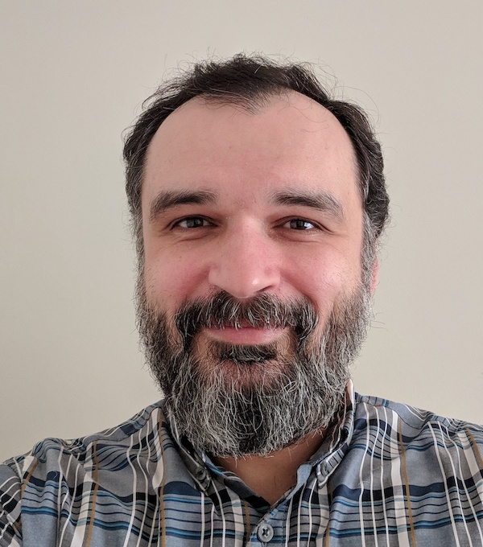
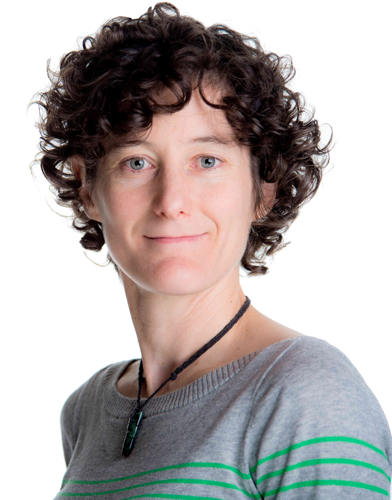

 
This school is offered by [Simon Fraser University](https://www.sfu.ca) on behalf of Western Universities and the [Digital Research Alliance of Canada](https://alliancecan.ca). It is hosted by [SFU's Big Data Hub](https://www.sfu.ca/big-data.html) and is open to all researchers at SFU and other Canadian post-secondary institutions.

## Instructors

:::{layout="[[2, 8], [1], [2, 8]]"}

Alex Razoumov earned his PhD in computational astrophysics from the University of British Columbia and held postdoctoral positions in Urbana-Champaign, San Diego, Oak Ridge, and Halifax. He spent five years as HPC Analyst in SHARCNET and in 2014 moved back to Vancouver to focus on scientific visualization and training researchers to use advanced computing tools. Alex is currently at Simon Fraser University.

 

Evolutionary and behavioural ecologist by training, [Software/Data Carpentry instructor,](https://carpentries.org/) and open source advocate, [Marie-Hélène Burle](https://www.sfu.ca/~msb2/) develops and delivers training for researchers on high-performance computing tools (R, Python, Julia, Git, Bash scripting, machine learning, parallel scientific programming, and HPC) for [Simon Fraser University](https://www.sfu.ca/) and the [Digital Research Alliance of Canada.](https://alliancecan.ca/)

:::
